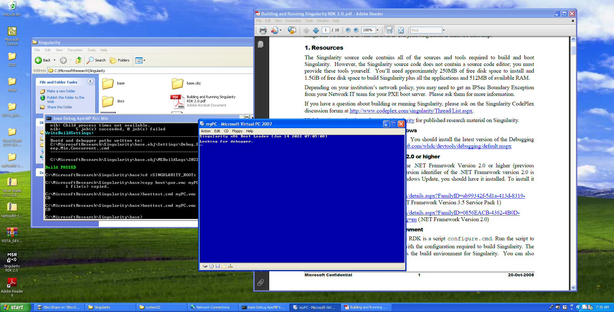
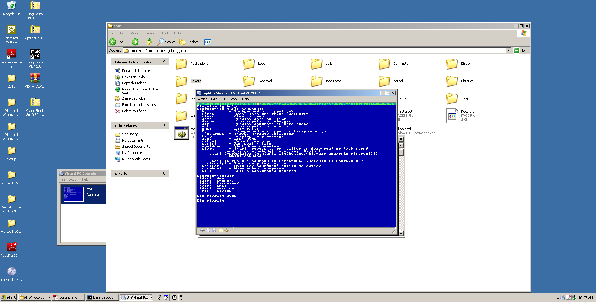
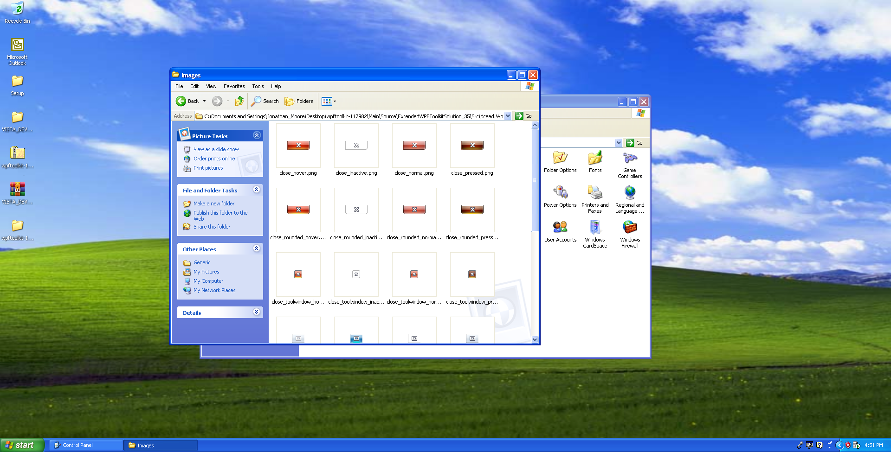
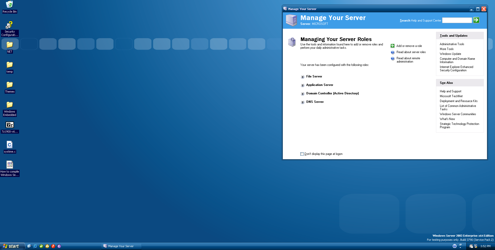

The Goal Of this Framework in to make an Operating System out of Singularity. Please fork Singularity, the DLR, and NET Micro. Please to not take my orginal Runtime copyrights, Website Or Trust Co.

The build Singularity execute 'congifugre.cmd' then from the Singularity prompt placed on the desktop type 
'msb Distro\World.proj'

### My Windows 2003 SP1 Build for Testing Purposes only.

